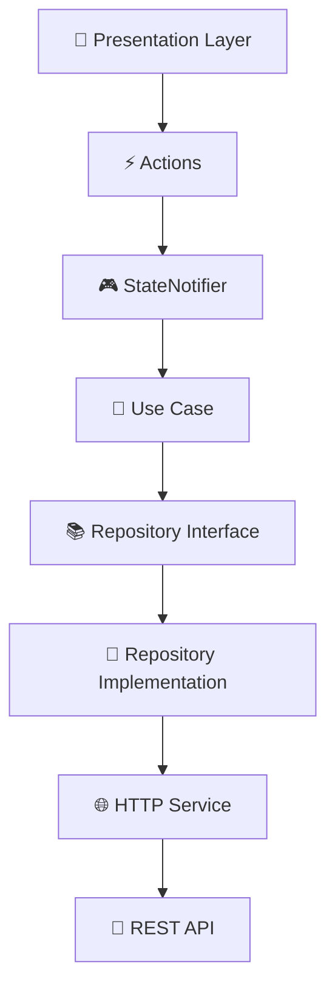

# Chat App - Clean Architecture

Una aplicación de chat implementada con **Clean Architecture** usando Flutter, Dio + Retrofit, y Riverpod.

## 🏗️ Arquitectura

Esta aplicación sigue los principios de **Clean Architecture** con la siguiente estructura:

```
lib/
├── config/                     # 🔧 Configuración global
│   └── networking/             
│       └── dio_provider.dart   # Configuración de Dio + Interceptors
├── domain/                     # 🎯 Lógica de negocio (independiente)
│   ├── entities/               # Entidades del dominio
│   ├── repositories/           # Interfaces (contratos)
│   └── usecases/              # Casos de uso con validaciones
├── infrastructure/             # 🔌 Implementaciones externas
│   ├── models/                # DTOs para HTTP/Base de datos
│   ├── services/              # Servicios HTTP (Retrofit)
│   ├── repositories/          # Implementaciones de interfaces
│   └── di/                    # Inyección de dependencias
└── presentation/              # 🎨 UI y lógica de presentación
    └── flows/                 # Flujos organizados por característica
        └── login/
            ├── actions/       # Acciones (sealed classes)
            ├── state/         # Estado inmutable
            ├── notifier/      # StateNotifier
            ├── pages/         # Páginas/Screens
            └── widgets/       # Widgets específicos
```

## 🚀 Características Implementadas

### ✅ **Login con Clean Architecture**
- **HTTP POST** real con Dio + Retrofit
- **Validaciones de dominio** (email, contraseña)
- **Estado inmutable** con `copyWith`
- **Manejo robusto de errores** (401, 500, timeout)
- **Inyección de dependencias** completa con Riverpod
- **Tests de integración** incluidos

### ✅ **Tecnologías Utilizadas**
- **Flutter**: Framework de UI multiplataforma
- **Dio + Retrofit**: Cliente HTTP con generación de código
- **Riverpod**: Gestión de estado y DI
- **Clean Architecture**: Separación de responsabilidades
- **Sealed Classes**: Type-safe actions
- **Code Generation**: Automático con `build_runner`

## 🛠️ Instalación y Configuración

### 1. Instalar Dependencias
```bash
flutter pub get
```

### 2. Generar Código
```bash
dart run build_runner build --delete-conflicting-outputs
```

### 3. Configurar Servidor
Edita `lib/global/environment.dart`:
```dart
static const String apiUrl = 'http://tu-servidor:3000/api';
```

### 4. Ejecutar la App
```bash
flutter run
```

## 📱 Uso de la Aplicación

### Login
La pantalla de login implementa:
- ✅ Validación en tiempo real de email y contraseña
- ✅ Estados de loading, error y éxito
- ✅ Petición HTTP POST al endpoint `/login`
- ✅ Manejo automático de errores de red

```dart
// Ejemplo de uso en un widget
class MyWidget extends ConsumerWidget {
  @override
  Widget build(BuildContext context, WidgetRef ref) {
    final loginState = ref.loginState;
    
    return Column(
      children: [
        TextField(
          onChanged: ref.updateEmail,
          decoration: InputDecoration(
            errorText: !loginState.isEmailValid ? 'Email inválido' : null,
          ),
        ),
        ElevatedButton(
          onPressed: loginState.canSubmit ? ref.submitLogin : null,
          child: loginState.isLoading 
            ? CircularProgressIndicator()
            : Text('Login'),
        ),
      ],
    );
  }
}
```

## 🧪 Testing

### Ejecutar Tests
```bash
# Tests unitarios
flutter test

# Tests de integración
flutter test integration_test/
```

### Estructura de Tests
- **Unit Tests**: Casos de uso y lógica de dominio
- **Integration Tests**: Flujos completos de UI

## 🏭 Flujo de Datos



## 🔧 Desarrollo

### Agregar Nueva Feature
1. **Crear entidades** en `domain/entities/`
2. **Definir repository interface** en `domain/repositories/`
3. **Implementar caso de uso** en `domain/usecases/`
4. **Crear modelos HTTP** en `infrastructure/models/`
5. **Implementar servicio** en `infrastructure/services/`
6. **Implementar repository** en `infrastructure/repositories/`
7. **Crear actions/state** en `presentation/flows/`
8. **Crear notifier** en `presentation/flows/`
9. **Configurar DI** en `infrastructure/di/`

### Comandos Útiles
```bash
# Análisis de código
flutter analyze

# Formatear código
dart format .

# Generar código
dart run build_runner build

# Limpiar build
flutter clean && flutter pub get
```

## 📋 API Esperada

El servicio espera un endpoint `/login` que reciba:

```json
POST /api/login
{
  "email": "usuario@example.com",
  "password": "123456"
}
```

Y retorne:
```json
{
  "ok": true,
  "token": "jwt-token-here",
  "usuario": {
    "uid": "user-id",
    "nombre": "Nombre Usuario",
    "email": "usuario@example.com",
    "online": true
  }
}
```

## 🤝 Contribución

1. Fork el proyecto
2. Crea una rama para tu feature (`git checkout -b feature/nueva-feature`)
3. Commit tus cambios (`git commit -am 'Add nueva feature'`)
4. Push a la rama (`git push origin feature/nueva-feature`)
5. Abre un Pull Request

## 📄 Licencia

Este proyecto está bajo la Licencia MIT - ver el archivo [LICENSE](LICENSE) para detalles.

---

**Desarrollado con ❤️ usando Clean Architecture y Flutter**
